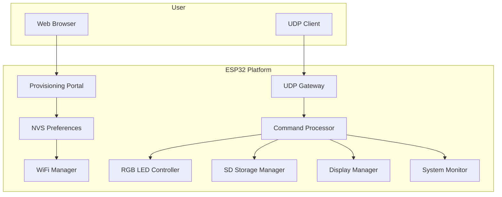
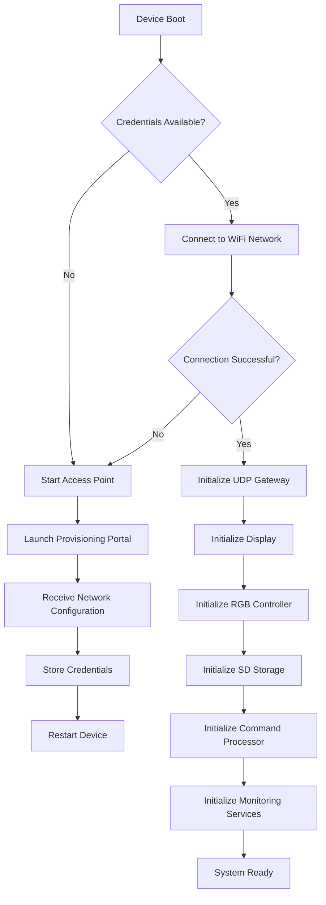
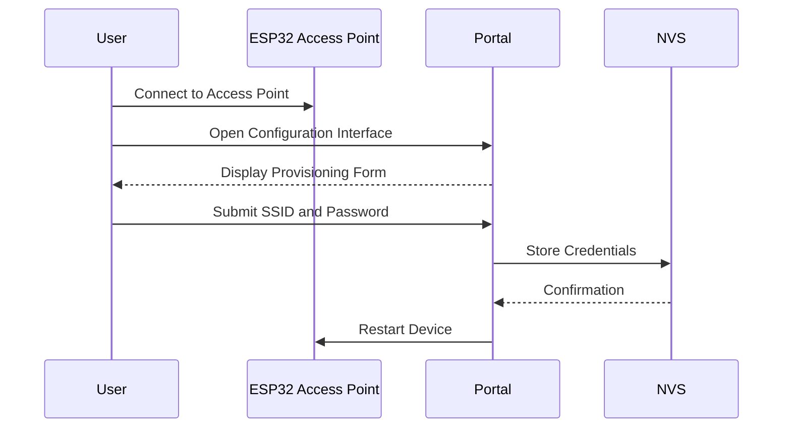
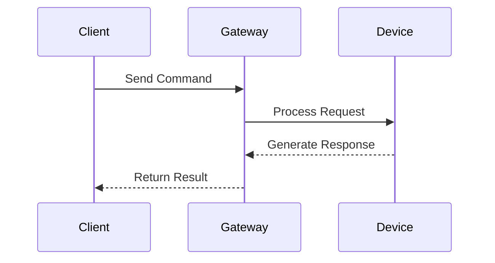

# ESP32 Network Provisioning and Remote Device Management Platform

## Overview

The ESP32 Network Provisioning and Remote Device Management Platform provides a modular and scalable architecture for network provisioning, remote device administration, hardware monitoring, and embedded application integration.

Designed for both production and educational environments, the platform enables secure Wi-Fi provisioning, persistent storage of network credentials, UDP-based communication, system diagnostics, and peripheral management without requiring firmware modifications.

---

# Key Capabilities

- Web-based Wi-Fi provisioning
- Persistent credential storage using NVS (Preferences)
- Automatic network reconnection
- UDP communication gateway
- Remote device management
- RGB LED control and status indication
- SD card storage support
- Real-time system monitoring
- CPU, memory, and flash diagnostics
- Network information reporting
- Device uptime monitoring
- Remote and local factory reset mechanisms
- Modular object-oriented software architecture

---

# Software Architecture

The framework is organized into independent modules, each responsible for a specific subsystem. The modular design promotes maintainability, reusability, portability, and straightforward integration into larger IoT solutions.



---

# System Startup Sequence

The platform follows a provisioning-first approach. If no network credentials are available, the device automatically enters provisioning mode.



---

# Wi-Fi Provisioning Workflow

The provisioning subsystem allows the device to be configured without requiring firmware changes.



---

# UDP Communication Architecture

Once connected to the network, the platform provides a UDP interface for remote management and monitoring.

**Default UDP Port**

```text
4210
```



---

# Command Reference

The platform exposes a UDP-based command interface for remote administration, device diagnostics, monitoring, and hardware control.

## Available Commands

| Command | Parameters | Description | Example Response |
|----------|------------|-------------|------------------|
| `RESET_WIFI` | None | Clears Wi-Fi configuration and forces reprovisioning. | `Wi-Fi configuration cleared` |
| `SET_FUSO:<gmt>` | GMT offset (-12 to +14) | Configures local timezone. | `Fuso alterado: GMT-3` |
| `DST_ON` | None | Enables daylight saving time (DST). | `Horario de Verao ativado com sucesso!` |
| `DST_OFF` | None | Disables daylight saving time (DST). | `Horario de Verao desativado com sucesso!` |
| `TIME` | None | Returns current local time. | `Hora atual: 10:30:25 (GMT-3)` |
| `DATE` | None | Returns current local date. | `Data atual: 2026-10-02` |
| `LED_ON` | None | Turns the onboard LED on. | `LED ligado` |
| `LED_OFF` | None | Turns the onboard LED off. | `LED desligado` |
| `LED_PISCA:<count>:<delay>` | Blink count and delay in ms | Executes a finite blink sequence. | `LED piscou 10 vezes com 250 ms` |
| `LED_BLINK:<interval>` | Blink interval in ms | Starts continuous asynchronous blinking. | `Blink iniciado (500 ms)` |
| `TEMP` | None | Returns internal CPU temperature. | `CPU Temp: 42.5` |
| `CPU` | None | Returns processor information. | CPU model, frequency, cores and memory |
| `RAM` | None | Returns memory statistics. | Free heap, minimum heap and largest block |
| `FLASH` | None | Returns flash memory information. | Flash size and available storage |
| `INIT` | None | Returns the last reset reason. | `Motivo reset: 1` |
| `UPTIME` | None | Returns device uptime in milliseconds. | `Uptime: 123456 ms` |
| `MAC` | None | Returns device MAC address. | `MAC: AA:BB:CC:DD:EE:FF` |
| `NET_INFO` | None | Returns network status information. | IP, Gateway, Subnet, RSSI and SSID |

---

# Command Categories

## Network Management

### RESET_WIFI

Clears all stored Wi-Fi credentials and restarts the provisioning process.

```text
RESET_WIFI
```

---

### SET_FUSO

Configures the device timezone.

```text
SET_FUSO:-3
```

Valid values:

```text
-12 to +14
```

Example response:

```text
Fuso alterado: GMT-3
```

---

### DST_ON

Enables daylight saving time.

```text
DST_ON
```

Example response:

```text
Horario de Verao ativado com sucesso!
```

---

### DST_OFF

Disables daylight saving time.

```text
DST_OFF
```

Example response:

```text
Horario de Verao desativado com sucesso!
```

---

## Date and Time

### TIME

Returns current local time according to the configured timezone.

```text
TIME
```

Example response:

```text
Hora atual: 14:53:28 (GMT-3)
```

---

### DATE

Returns current local date.

```text
DATE
```

Example response:

```text
Data atual: 2026-10-02
```

---

## LED Control

### LED_ON

Turns on the onboard LED.

```text
LED_ON
```

---

### LED_OFF

Turns off the onboard LED.

```text
LED_OFF
```

---

### LED_BLINK

Starts continuous asynchronous blinking.

```text
LED_BLINK:500
```

Parameters:

```text
500 = interval in milliseconds
```

---

### LED_PISCA

Performs a finite blink sequence.

```text
LED_PISCA:10:250
```

Parameters:

```text
10  = blink count
250 = delay in milliseconds
```

---

## Hardware Monitoring

### TEMP

Returns the internal ESP32 temperature.

```text
TEMP
```

Example response:

```text
CPU Temp: 42.50
```

---

### CPU

Returns processor information.

```text
CPU
```

Example response:

```text
Model: ESP32-C6
Revision: 1
Cores: 1
CPU: 160 MHz
RAM Free: 234812 bytes
```

---

### RAM

Returns memory information.

```text
RAM
```

Example response:

```text
Heap Free: 234812
Min Heap: 220140
Largest Block: 145320
```

---

### FLASH

Returns flash memory statistics.

```text
FLASH
```

Example response:

```text
Flash Total: 4194304
Flash Speed: 80000000
Sketch Size: 842123
Free Space: 1234567
```

---

### INIT

Returns the reason for the last system reset.

```text
INIT
```

Example response:

```text
Reset Reason: 1
```

---

### UPTIME

Returns device uptime.

```text
UPTIME
```

Example response:

```text
Uptime: 12548742 ms
```

---

## Network Information

### MAC

Returns device MAC address.

```text
MAC
```

Example response:

```text
MAC: AA:BB:CC:DD:EE:FF
```

---

### NET_INFO

Returns detailed network information.

```text
NET_INFO
```

Example response:

```text
IP: 192.168.1.100
Gateway: 192.168.1.1
Mask: 255.255.255.0
RSSI: -52 dBm
SSID: OfficeWiFi
```

---

# Command Processing Architecture


---

# Repository Structure

```text
src/
├── WiFiManager
├── UDPGateway
├── CommandProcessor
├── RGBLed
├── SDStorageManager
├── DisplayManager
├── SystemMonitor
└── Utilities

docs/
data/
README.md
```

---

# Core Components

## WiFiManager

Responsible for wireless network lifecycle management, including:

- Wi-Fi provisioning
- Access Point creation
- Connection establishment
- Automatic reconnection
- NVS credential persistence

---

## UDPGateway

Provides a lightweight communication layer for remote command execution and integration with external systems through UDP messaging.

Responsibilities include:

- Packet reception
- Response transmission
- Client session handling
- Command routing

---

## CommandProcessor

Implements the command execution subsystem.

Responsibilities include:

- Command parsing
- Input validation
- Request dispatching
- Response generation

---

## RGBLed

Provides visual status indication and LED management.

Capabilities include:

- RGB color control
- Blink effects
- Connection status indication
- Error signaling

---

## SDStorageManager

Provides file system abstraction and persistent storage operations.

Capabilities include:

- SD card initialization
- File reading
- File writing
- Storage management

---

## DisplayManager

Responsible for presenting operational information to the user.

Capabilities include:

- Device status display
- Network information display
- Diagnostic messages
- User notifications

---

## SystemMonitor

Provides operational metrics and diagnostics.

Monitored resources include:

- CPU utilization
- Heap memory
- Flash memory
- Device temperature
- Network status
- Uptime statistics
- Reset diagnostics

---

# Target Applications

This platform is suitable for:

- Industrial IoT deployments
- Smart building infrastructure
- Sensor and telemetry systems
- Edge computing solutions
- Remote monitoring platforms
- Research and development projects
- Academic laboratories
- Embedded systems education

---

# Design Principles

The platform was developed following the principles of modularity, maintainability, extensibility, and hardware abstraction.

Each subsystem operates independently, reducing coupling and enabling future enhancements with minimal impact on existing components.

The architecture allows additional communication protocols, peripherals, storage backends, and monitoring capabilities to be integrated through well-defined interfaces, supporting long-term scalability and maintainability.

---

# License

This project is released under the license defined by the repository owner.
