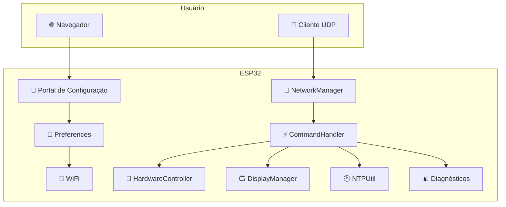
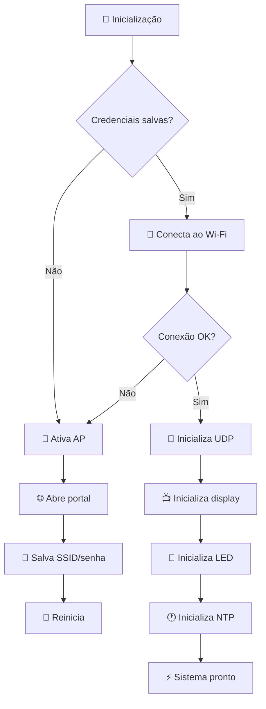
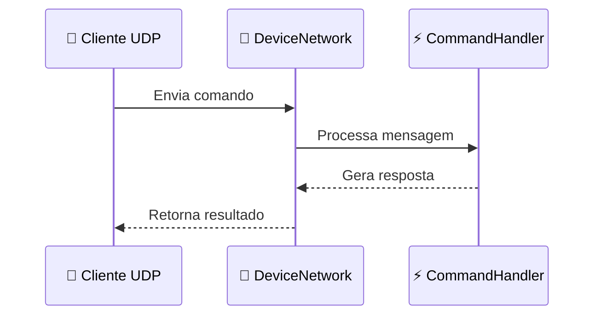

# 🌐 ESP32 Wi‑Fi Provisioning & Remote Device Management

<div align="center">


**Plataforma modular para provisionamento Wi‑Fi, monitoramento e controle remoto de dispositivos ESP32 via rede local.**

</div>

---

## 🎯 Visão geral

Este projeto foi pensado para simplificar o ciclo de vida operacional de dispositivos ESP32 em rede local. Ele combina:

- provisionamento Wi‑Fi via portal local
- armazenamento persistente de credenciais
- sincronização NTP
- monitoramento de hardware
- controle remoto via UDP
- gerenciamento de LED, display e diagnósticos

É um projeto modular, com responsabilidades separadas por arquivos e componentes, permitindo evoluir com facilidade e manter manutenção simples.

---

## ✨ Funcionalidades principais

<table>
  <tr>
    <td width="50%">
      <h3>🔐 Provisionamento e segurança</h3>
      <ul>
        <li>Portal de configuração em modo AP</li>
        <li>Armazenamento persistente de SSID/senha em Preferences</li>
        <li>Reconexão automática e reset de credenciais</li>
        <li>Modo de recuperação via reset Wi‑Fi</li>
      </ul>
    </td>
    <td width="50%">
      <h3>📡 Controle remoto</h3>
      <ul>
        <li>Gateway UDP na porta 4210</li>
        <li>Comandos textuais simples</li>
        <li>Resposta direta para cliente remoto</li>
        <li>Diagnóstico e monitoramento via rede</li>
      </ul>
    </td>
  </tr>
  <tr>
    <td width="50%">
      <h3>🎛️ Integração com hardware</h3>
      <ul>
        <li>Controle de LED</li>
        <li>Atualização de display</li>
        <li>Suporte de monitoramento do sistema</li>
        <li>Gerenciamento de reset e estado do dispositivo</li>
      </ul>
    </td>
    <td width="50%">
      <h3>📊 Monitoramento</h3>
      <ul>
        <li>Temperatura da CPU</li>
        <li>Heap e RAM livres</li>
        <li>Flash e PSRAM</li>
        <li>Uptime, NTP e motivo do último reset</li>
      </ul>
    </td>
  </tr>
</table>

---

## 🚀 Guia rápido

### Pré-requisitos

- ESP32
- Arduino IDE ou PlatformIO
- Cabo USB para gravação
- Rede Wi‑Fi local

### 1) Clone o repositório

```bash
git clone https://github.com/paulocfmarques-collab/esp32_wifi.git
cd esp32_wifi
```

### 2) Configure o projeto

O projeto usa arquivos de configuração em nível de código, como:

```cpp
#include "Config.h"
```

Edite `Config.h` conforme a sua aplicação e a pinagem do hardware.

### 3) Faça o upload para o ESP32

No Arduino IDE:

- abra `wifi.ino`
- selecione a placa ESP32 correta
- escolha a porta serial
- faça upload

Ou com PlatformIO:

```bash
pio run -t upload
```

### 4) Primeiro acesso

Ao iniciar sem credenciais salvas, o dispositivo entra em modo AP e abre um portal local.

- SSID do AP: `ESP32_CONFIG`
- Portal: `http://192.168.4.1`
- Informe SSID e senha da rede Wi‑Fi
- Salve e reinicie o dispositivo

---

## 🏗️ Arquitetura do sistema



### Fluxo de boot



---

## 📡 Protocolo de comunicação

- Porta UDP padrão: `4210`
- Payload: texto simples
- Resposta: texto estruturado em retorno UDP
- Cliente pode enviar comandos diretamente para o ESP32 conectado na LAN



---

## 🎮 Lista de comandos implementados

A lista abaixo reflete os comandos efetivamente presentes no projeto atual, conforme `CommandHandler.h` e `wifi.ino`.

### 🔹 Comandos gerais e diagnósticos

| Comando | Sintaxe | Descrição |
| :--- | :--- | :--- |
| `help` | `help` | Lista os comandos disponíveis |
| `info` | `info` | Exibe status completo do dispositivo |
| `status` | `status` | Resumo rápido de rede, heap e NTP |
| `reason` | `reason` | Mostra o motivo do último reset |
| `version` | `version` | Retorna a versão do firmware |
| `build` | `build` | Exibe data e hora da compilação |
| `cpu` | `cpu` | Modelo, revisão, núcleos e frequência |
| `ram` | `ram` | Heap total, livre, menor e maior bloco |
| `flash` | `flash` | Informações da flash e espaço livre |
| `temp` | `temp` | Temperatura interna da CPU |
| `mac` | `mac` | Endereço MAC do Wi‑Fi |
| `net_info` | `net_info` | SSID, IP, gateway, subnet, DNS e RSSI |
| `uptime` | `uptime` | Tempo de atividade em segundos |
| `time` | `time` | Hora atual via NTP |
| `date` | `date` | Data atual via NTP |
| `reset` | `reset` | Reinicia o ESP32 |
| `alive` | `alive` | Verificação de presença / resposta ping |
| `psram` | `psram` | Estado e uso da PSRAM, quando disponível |

### 🔧 Comandos de configuração

| Comando | Sintaxe | Descrição |
| :--- | :--- | :--- |
| `set_fuso` | `set_fuso:-3` | Ajusta o timezone usado pelo NTP |
| `reset_wifi` | `reset_wifi` | Limpa credenciais e reinicia para configurar novamente |
| `dst_on` | `dst_on` | Ativa horário de verão |
| `dst_off` | `dst_off` | Desativa horário de verão |

### 💡 Comandos de LED

| Comando | Sintaxe | Descrição |
| :--- | :--- | :--- |
| `led_on` | `led_on` | Liga o LED |
| `led_off` | `led_off` | Desliga o LED |
| `led_pisca` | `led_pisca:10:250` | Pisca N vezes com intervalo em ms |
| `led_blink` | `led_blink:500` | Liga o blink assíncrono com intervalo em ms |

### Exemplo de uso

```text
help
info
status
net_info
TIME
LED_ON
LED_BLINK:500
RESET_WIFI
SET_FUSO:-3
```

---

## 📁 Estrutura real do repositório

A estrutura atual do projeto é a seguinte:

```text
esp32_wifi/
├── CHANGELOG.md
├── CommandHandler.h
├── Config.h
├── DisplayManager.h
├── HardwareController.h
├── NTPUtil.h
├── NetworkManager.h
├── README.md
├── wifi.ino
└── LICENSE (se presente no fork/clone)
```

> O README anterior descrevia uma estrutura baseada em `src/`, `include/`, `docs/` e `data/`, mas a árvore real do repositório atual é a listada acima.

---

## 🔧 Componentes principais

### `NetworkManager.h`

Responsável por:

- conexão Wi‑Fi
- criação e controle do portal AP
- armazenamento de credenciais em `Preferences`
- inicialização do socket UDP
- envio de respostas para o cliente remoto
- validação e processamento de mensagens UDP

### `CommandHandler.h`

Responsável por:

- parser dos comandos recebidos
- execução de diagnósticos locais
- manipulação de tempo, reset, rede e hardware
- respostas em texto para o cliente UDP
- controle de LED, NTP, memória e processamento

### `DisplayManager.h`

Responsável por:

- renderização visual do estado do dispositivo
- apresentação de mensagens e diagnósticos
- feedback visual para uso local

### `HardwareController.h`

Responsável por:

- controle do LED físico
- sincronização de blink
- leitura de temperatura
- gestão básica de estados do hardware

### `NTPUtil.h`

Responsável por:

- sincronização temporal via NTP
- cálculo de fuso horário
- suporte a horário de verão
- atualização de data/hora para comandos `time` e `date`

### `Config.h`

Arquivo central com constantes e parâmetros do projeto, como:

- porta UDP
- nome da rede AP
- fuso padrão
- parâmetros globais do sistema

---

## 🧪 Troubleshooting

### Wi‑Fi não conecta

- Verifique se as credenciais estão corretas
- Delete as informações salvas usando `reset_wifi`
- Confirme que a rede é 2.4 GHz e está acessível

### Socket UDP não responde

- Confirme se o ESP32 está conectado à rede local
- Verifique se a porta `4210` está liberada
- Teste o comando `alive`
- Confirme o IP do dispositivo com `net_info`

### NTP não sincroniza

- Verifique conexão com a internet
- Ajuste o fuso com `set_fuso:-3`
- Teste `dst_on` e `dst_off` se o comportamento exigir

### LED não responde

- Verifique a pinagem do hardware
- Teste `led_on`, `led_off` e `led_blink`
- Confirme que o sistema está com o controlador em execução

---

## 📝 Changelog

O histórico de mudanças está em [`CHANGELOG.md`](./CHANGELOG.md).

---

## 🤝 Contribuição

Contribuições são bem-vindas.

1. Faça um fork do projeto
2. Crie uma branch para a feature
3. Faça o commit das alterações
4. Abra um Pull Request

---

## 📄 Licença

Este repositório ainda não declara uma licença explícita no arquivo principal. Caso queira publicar publicamente, recomenda-se adicionar uma licença como MIT, Apache 2.0 ou GPL.

---

## 📞 Suporte

- Issues: https://github.com/paulocfmarques-collab/esp32_wifi/issues
- Pull Requests: https://github.com/paulocfmarques-collab/esp32_wifi/pulls

---

<div align="center">

**Feito com ❤️ para a comunidade ESP32 e IoT**

</div>
