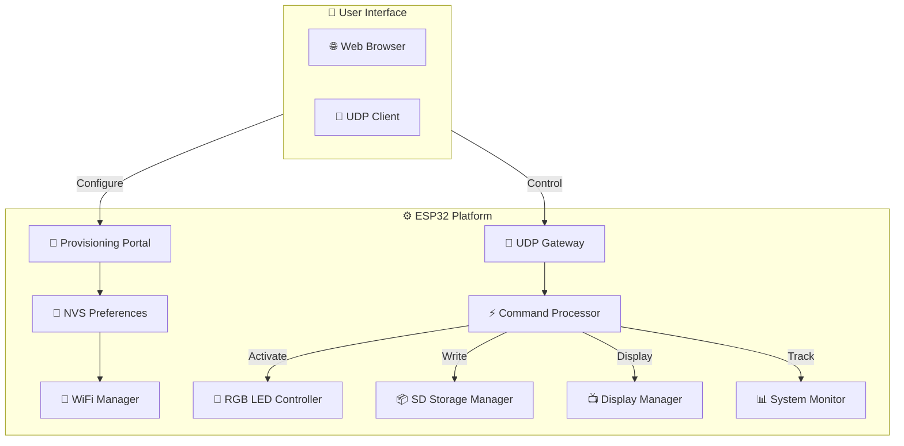
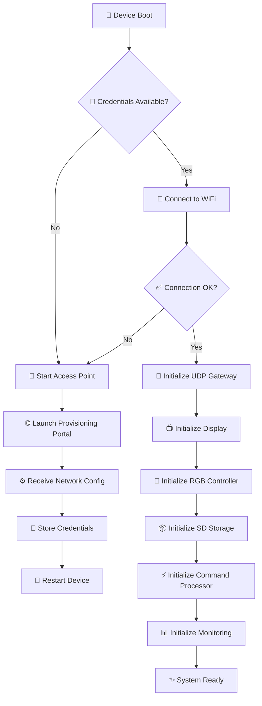
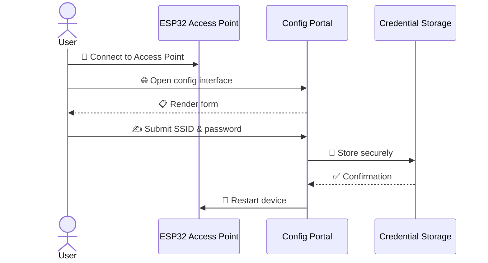
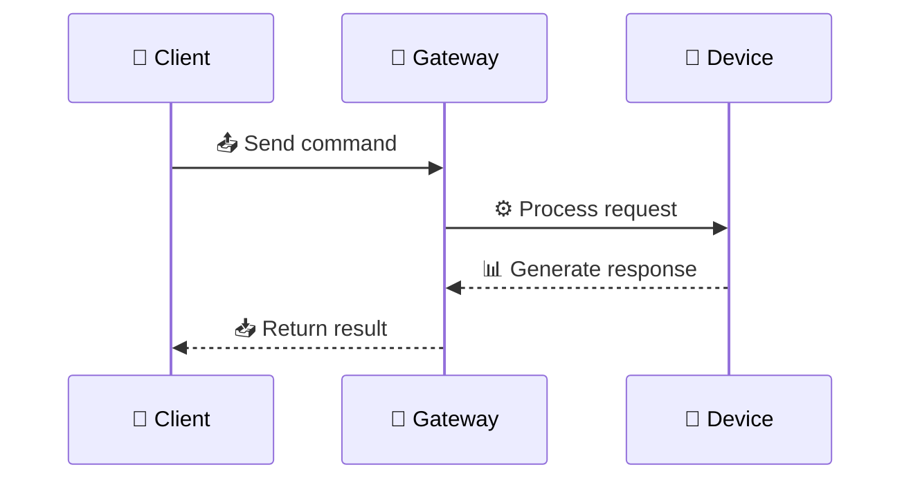
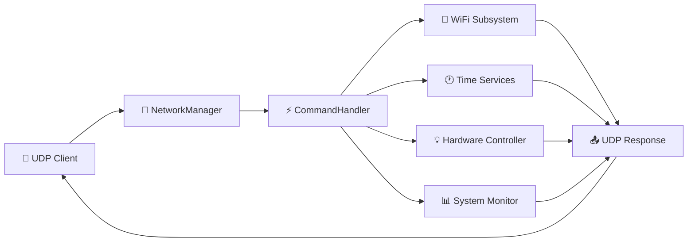

# 🌐 ESP32 Network Provisioning & Remote Device Management

<div align="center">


**A production-grade platform for securing, configuring, monitoring, and managing ESP32 devices over Wi-Fi and UDP**

[Features](#-features) • [Quick Start](#-quick-start) • [Architecture](#-architecture) • [Commands](#-command-reference) • [Contributing](#-contributing)

</div>

---

## 🎯 What is This?

A robust, modular, and extensible platform designed to simplify the entire operational lifecycle of ESP32-based IoT devices. Built for real-world embedded applications, this project combines seamless wireless provisioning, persistent storage, remote management, and comprehensive system diagnostics.

**Perfect for:** Industrial IoT, Smart Buildings, Sensor Networks, Edge Computing, and Research Projects

---

## ✨ Key Features

<table>
  <tr>
    <td width="50%">
      <h3>🔐 Security & Configuration</h3>
      <ul>
        <li>Secure Wi-Fi provisioning without firmware re-flashing</li>
        <li>Persistent credential storage using NVS</li>
        <li>Automatic reconnection & resilient networking</li>
        <li>Local & remote factory reset support</li>
      </ul>
    </td>
    <td width="50%">
      <h3>📡 Remote Management</h3>
      <ul>
        <li>UDP-based gateway for remote control</li>
        <li>Real-time command execution</li>
        <li>Structured device diagnostics</li>
        <li>Health reporting & telemetry</li>
      </ul>
    </td>
  </tr>
  <tr>
    <td>
      <h3>🎛️ Hardware Integration</h3>
      <ul>
        <li>RGB LED status feedback</li>
        <li>Display integration</li>
        <li>SD storage management</li>
        <li>Multi-sensor support</li>
      </ul>
    </td>
    <td>
      <h3>📊 Monitoring & Analytics</h3>
      <ul>
        <li>CPU & memory tracking</li>
        <li>Flash storage monitoring</li>
        <li>Network metadata reporting</li>
        <li>Device uptime & reset diagnostics</li>
      </ul>
    </td>
  </tr>
</table>

---

## 🚀 Quick Start

### Prerequisites
- ESP32 development board
- PlatformIO or Arduino IDE
- USB cable for flashing

### Installation

1. **Clone the repository**
```bash
git clone https://github.com/paulocfmarques-collab/esp32_wifi.git
cd esp32_wifi
```

2. **Configure your environment**
```bash
# Edit configuration as needed
cp include/config.example.h include/config.h
```

3. **Flash to ESP32**
```bash
# Using PlatformIO
pio run -t upload

# Or using Arduino IDE
# Open sketch and upload to your board
```

4. **Access provisioning portal**
   - Device enters AP mode on first boot
   - Connect to `ESP32-Setup` WiFi network
   - Open browser to `http://192.168.4.1`
   - Configure your network credentials

---

## 🏗️ Architecture Overview

### System Design



### Device Lifecycle



### Wi-Fi Provisioning Flow



---

## 📡 Communication Protocol

### UDP Gateway
- **Default Port:** `4210`
- **Protocol:** UDP (connectionless)
- **Payload:** Plain text commands
- **Response:** Structured text feedback



---

## 🎮 Command Reference

### Network Management

| Command | Parameters | Description | Example |
|---------|-----------|-------------|---------|
| `RESET_WIFI` | None | Clear Wi-Fi config & re-provision | `RESET_WIFI` |
| `SET_FUSO:<gmt>` | GMT (-12 to +14) | Configure timezone | `SET_FUSO:-3` |
| `NET_INFO` | None | Get network status | `NET_INFO` |
| `MAC` | None | Get device MAC address | `MAC` |

### Date & Time

| Command | Parameters | Description | Example |
|---------|-----------|-------------|---------|
| `TIME` | None | Current local time | `TIME` |
| `DATE` | None | Current local date | `DATE` |
| `DST_ON` | None | Enable daylight saving | `DST_ON` |
| `DST_OFF` | None | Disable daylight saving | `DST_OFF` |

### LED Control

| Command | Parameters | Description | Example |
|---------|-----------|-------------|---------|
| `LED_ON` | None | Turn LED on | `LED_ON` |
| `LED_OFF` | None | Turn LED off | `LED_OFF` |
| `LED_BLINK:<ms>` | Interval (ms) | Continuous blink | `LED_BLINK:500` |
| `LED_PISCA:<count>:<ms>` | Count, Interval (ms) | Finite blink sequence | `LED_PISCA:10:250` |

### Hardware Monitoring

| Command | Parameters | Description | Response |
|---------|-----------|-------------|----------|
| `TEMP` | None | CPU temperature | `CPU Temp: 42.5°C` |
| `CPU` | None | Processor info | Model, frequency, cores, memory |
| `RAM` | None | Memory statistics | Free heap, min heap, largest block |
| `FLASH` | None | Flash memory info | Total size, free storage |
| `UPTIME` | None | Device uptime | Milliseconds since boot |
| `INIT` | None | Last reset reason | Reset code & description |

### Command Execution Flow



---

## 📁 Repository Structure

```
esp32_wifi/
│
├── src/
│   ├── WiFiManager/           # Wireless lifecycle management
│   │   ├── WiFiManager.cpp
│   │   └── WiFiManager.h
│   ├── UDPGateway/           # UDP communication layer
│   │   ├── UDPGateway.cpp
│   │   └── UDPGateway.h
│   ├── CommandProcessor/     # Command execution engine
│   │   ├── CommandProcessor.cpp
│   │   └── CommandProcessor.h
│   ├── RGBLed/               # LED control subsystem
│   ├── SDStorageManager/     # SD card abstraction
│   ├── DisplayManager/       # Display integration
│   ├── SystemMonitor/        # Runtime metrics
│   └── Utilities/            # Common utilities
│
├── include/
│   ├── config.h              # Configuration constants
│   └── config.example.h      # Configuration template
│
├── docs/                      # Documentation & guides
├── data/                      # Static assets & web files
├── platformio.ini            # PlatformIO configuration
├── README.md                 # This file
└── LICENSE                   # License information
```

---

## 🔧 Core Components

### 📡 WiFiManager
Manages the complete wireless lifecycle of the device.

**Responsibilities:**
- Wi-Fi provisioning through web portal
- Access point creation & management
- Network connection establishment
- Automatic reconnection logic
- Persistent credential storage (NVS)
- Connection state monitoring

### 🚪 UDPGateway
Provides the communication layer for remote command execution.

**Responsibilities:**
- UDP packet reception & transmission
- Client session handling
- Message queuing & delivery
- Command routing & dispatching
- Response generation & error handling

### ⚡ CommandProcessor
Implements the command execution subsystem.

**Responsibilities:**
- Command parsing & tokenization
- Input validation & sanitization
- Request dispatching to subsystems
- Response formatting & transmission
- Error handling & logging

### 🎨 RGBLed
Provides visual status signaling and feedback.

**Capabilities:**
- Full RGB color control
- Blink & pulse effects
- Connection status indication
- Error & warning signaling
- Custom animation sequences

### 📦 SDStorageManager
Abstracts SD card operations for persistent storage.

**Capabilities:**
- SD card initialization & mounting
- File reading & writing
- Directory management
- Storage lifecycle management
- Error recovery

### 📺 DisplayManager
Presents device status and diagnostics to users.

**Capabilities:**
- Real-time device status display
- Network information reporting
- Diagnostic data visualization
- User notifications & alerts
- Multi-line text formatting

### 📊 SystemMonitor
Tracks runtime health and operational metrics.

**Monitored Metrics:**
- CPU usage & temperature
- Heap memory (free, minimum, largest block)
- Flash memory utilization
- Network connectivity status
- Device uptime & boot count
- Last reset reason & diagnostics

---

## 🎓 Use Cases

This platform excels in:

- **🏭 Industrial IoT** - Sensor networks, machine monitoring
- **🏢 Smart Buildings** - HVAC control, occupancy detection
- **📊 Data Collection** - Environmental monitoring, telemetry
- **🔬 Research** - Academic projects, prototyping
- **📡 Edge Computing** - Local processing, distributed systems
- **🎓 Education** - Embedded systems learning, IoT courses

---

## 🎨 Design Principles

This project follows a philosophy of:

- **🔲 Modularity** - Independent subsystems, minimal coupling
- **📚 Maintainability** - Clean code, extensive documentation
- **📈 Scalability** - Easy to extend with new features
- **🔌 Abstraction** - Hardware-agnostic interfaces
- **🛡️ Reliability** - Error handling & graceful degradation
- **⚡ Efficiency** - Optimized for embedded constraints

Each subsystem operates independently, making the platform easy to evolve. New protocols, peripherals, storage backends, and monitoring capabilities can be added without disrupting existing code.

---

## 📋 Configuration Guide

### Basic Configuration

Edit `include/config.h` to customize:

```cpp
// WiFi Configuration
#define WIFI_SSID_MAX_LEN 32
#define WIFI_PASS_MAX_LEN 64

// UDP Configuration
#define UDP_PORT 4210
#define UDP_BUFFER_SIZE 1024

// LED Configuration
#define LED_PIN_RED 25
#define LED_PIN_GREEN 26
#define LED_PIN_BLUE 27

// System Configuration
#define DEVICE_NAME "ESP32-Device"
#define TIMEZONE_OFFSET -3
```

---

## 📈 Performance Metrics

| Metric | Value |
|--------|-------|
| Boot Time | < 5s (with WiFi) |
| UDP Response Latency | < 100ms |
| Memory Footprint | ~150KB (program) |
| WiFi Reconnection | < 10s |
| Command Processing | < 50ms |

---

## 🤝 Contributing

Contributions are welcome! Here's how you can help:

1. **Fork** the repository
2. **Create** a feature branch (`git checkout -b feature/amazing-feature`)
3. **Commit** your changes (`git commit -m 'Add amazing feature'`)
4. **Push** to the branch (`git push origin feature/amazing-feature`)
5. **Open** a Pull Request

### Development Setup

```bash
# Clone your fork
git clone https://github.com/YOUR_USERNAME/esp32_wifi.git
cd esp32_wifi

# Install dependencies
pio pkg install

# Run tests
pio test

# Format code
clang-format -i src/**/*.cpp
```

---

## 🐛 Troubleshooting

### Device not entering provisioning mode
- Ensure NVS partition is properly formatted
- Check `RESET_WIFI` command was sent successfully
- Verify board has adequate power supply

### WiFi connection drops
- Check signal strength (RSSI)
- Verify credentials are stored correctly
- Check for interference on 2.4GHz band
- Update router firmware

### UDP commands not responding
- Verify device is connected to network
- Check firewall allows UDP on port 4210
- Confirm device IP address with `NET_INFO` command
- Check UDP buffer size configuration

### See [Troubleshooting Guide](./docs/TROUBLESHOOTING.md) for more help

---

## 📚 Documentation

- [Architecture Details](./docs/ARCHITECTURE.md)
- [API Reference](./docs/API.md)
- [Command Guide](./docs/COMMANDS.md)
- [Hardware Setup](./docs/HARDWARE.md)
- [Troubleshooting](./docs/TROUBLESHOOTING.md)

---

## 📄 License

This project is released under the **MIT License**. See [LICENSE](./LICENSE) file for details.

---

## 🙏 Acknowledgments

- Built with [PlatformIO](https://platformio.org/) & [Arduino](https://www.arduino.cc/)
- Inspired by IoT best practices and production requirements
- Community feedback and contributions

---

## 📞 Support & Contact

- **Issues & Bugs:** [GitHub Issues](https://github.com/paulocfmarques-collab/esp32_wifi/issues)
- **Discussions:** [GitHub Discussions](https://github.com/paulocfmarques-collab/esp32_wifi/discussions)
- **Documentation:** [Wiki](https://github.com/paulocfmarques-collab/esp32_wifi/wiki)

---

<div align="center">

**Made with ❤️ for the IoT Community**

If this project helped you, please consider giving it a ⭐!

[⬆ Back to Top](#-esp32-network-provisioning--remote-device-management)

</div>
