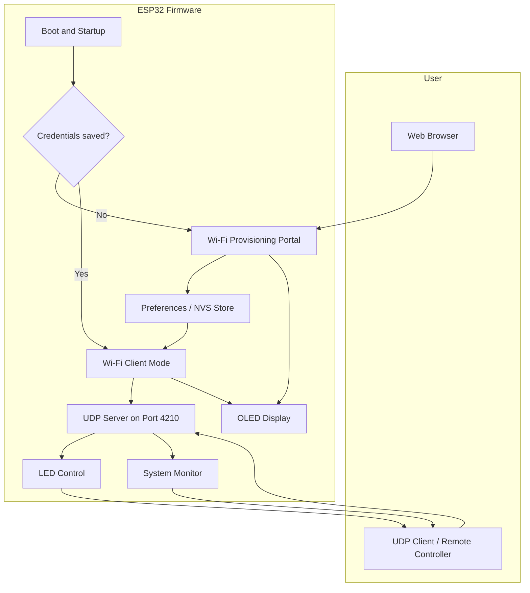
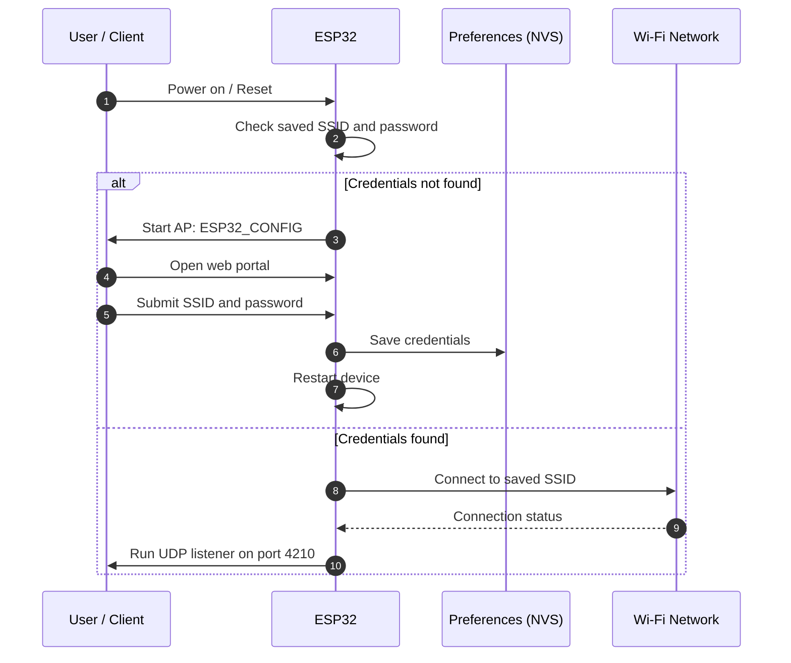
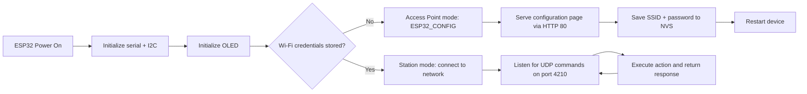
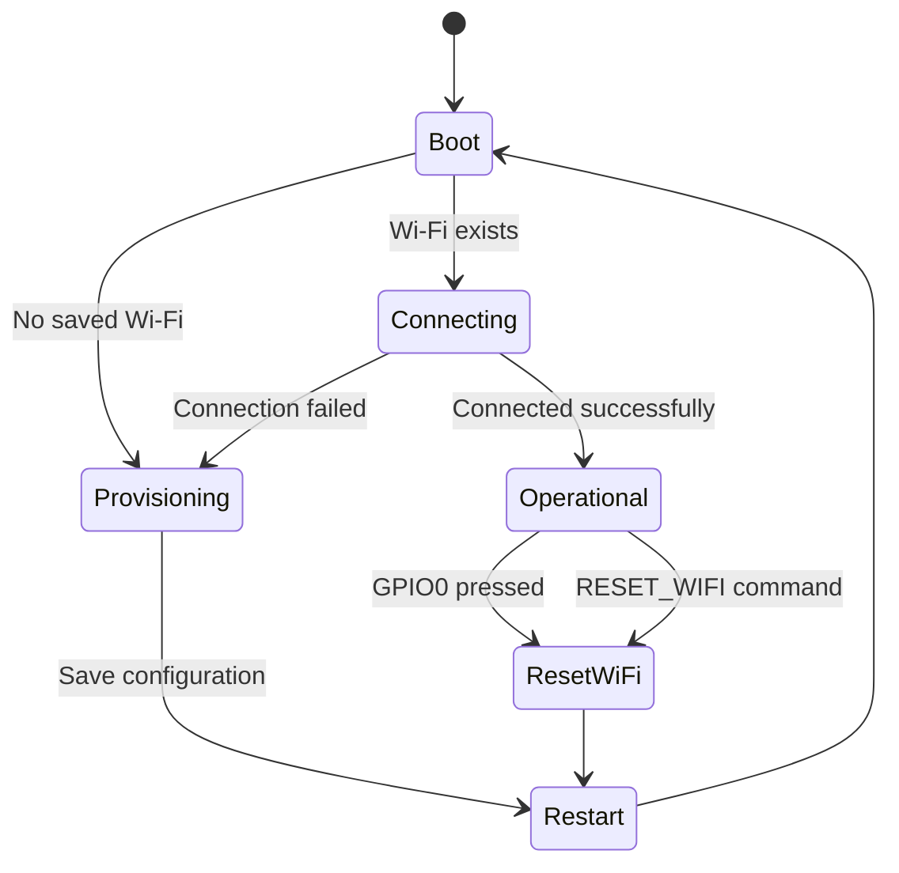
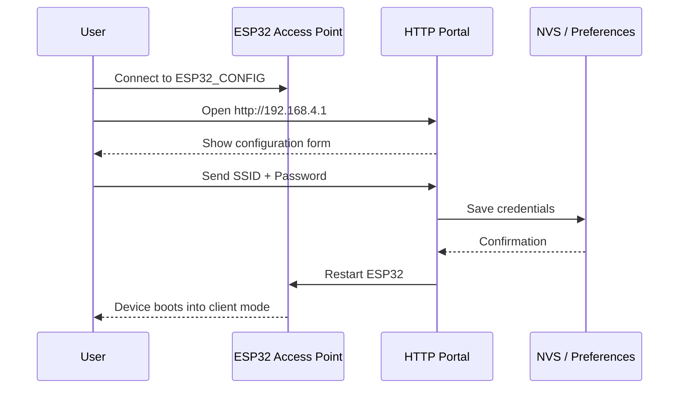
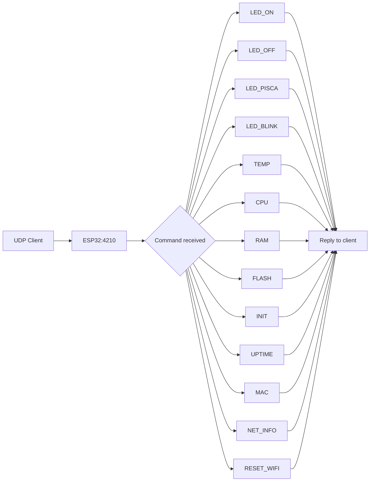
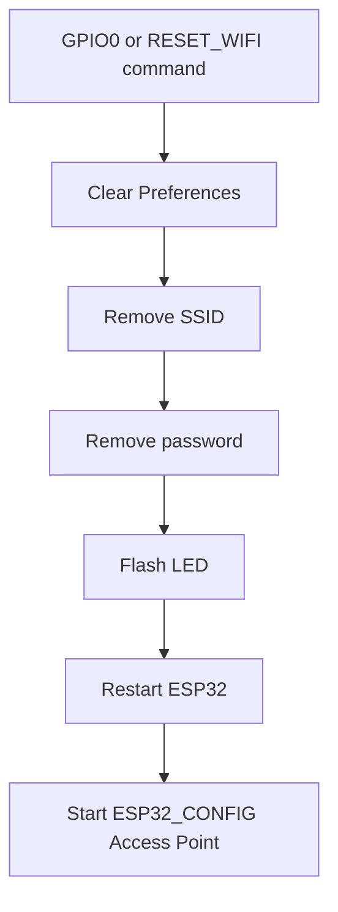

# ESP32 Wi-Fi Provisioning, Remote Monitoring & UDP Control

A complete ESP32 firmware for Wi-Fi provisioning through a captive web portal, persistence of credentials in NVS/Preferences, remote UDP control, hardware supervision, and device diagnostics.

This project turns an ESP32 into a small smart module capable of:

- creating its own configuration access point when no Wi-Fi is stored
- saving network credentials in non-volatile memory
- reconnecting automatically after boot
- serving a web form for Wi-Fi setup
- accepting remote UDP commands over port 4210
- controlling the onboard LED
- monitoring hardware metrics such as temperature, CPU, memory, uptime, and network data
- resetting Wi-Fi configuration via hardware button or command

---

## Overview

The firmware follows a simple and robust lifecycle:

1. Boot the ESP32
2. Check whether valid Wi-Fi credentials are stored in Preferences
3. If credentials exist, connect to the network automatically
4. If not, start an access point and serve a configuration page
5. Once configured, the device enters operational mode and listens for UDP commands
6. The system can report status, execute actions, and reset its Wi-Fi configuration when needed

---

## System Architecture



---

## High-Level Data Flow



---

## Hardware Wiring Diagram

The project uses a standard ESP32 development board, an SSD1306 OLED display, a status LED, and a reset button.

```text
                       +----------------------+
                       |      ESP32 DevKit    |
                       |                      |
        GPIO2  ─────────┤ LED                 |
                       |
        GPIO0  ─────────┤ BOOT / RESET BTN    |
                       |
        GPIO21 ─────────┤ SDA (OLED)          |
        GPIO22 ─────────┤ SCL (OLED)          |
                       |
                 3V3 ──┤ VCC (OLED)          |
                 GND ──┤ GND (OLED)          |
                       +----------------------+

                  +----------------------------+
                  |  SSD1306 128x64 OLED      |
                  |  I2C Address: 0x3C        |
                  +----------------------------+
```

### Pin Mapping

| Function | ESP32 Pin | Description |
|---|---:|---|
| LED | GPIO 2 | Status LED, used for visual feedback |
| RESET BUTTON | GPIO 0 | Resets Wi-Fi settings when pressed |
| OLED SDA | GPIO 21 | I2C data line |
| OLED SCL | GPIO 22 | I2C clock line |
| OLED VCC | 3V3 | Power |
| OLED GND | GND | Ground |

---

## Power and I/O Behavior



---

## Firmware State Machine



---

## Data Storage Model

The firmware stores network parameters in the ESP32 non-volatile memory via `Preferences`:

```text
Namespace: wifi
Keys:
- ssid
- senha
```

This guarantees that the device can reconnect automatically after power cycling without re-entering credentials.

---

## Wi-Fi Provisioning Flow

When no saved Wi-Fi information is available, the ESP32 starts an access point named:

```text
ESP32_CONFIG
```

Then the user:

1. connects to the access point
2. opens the web page on the access point IP
3. enters the SSID and password
4. submits the form
5. the ESP32 writes the values to Preferences
6. the module restarts and connects to the selected Wi-Fi network

### Provisioning Sequence



---

## UDP Communication

After a successful Wi-Fi connection, the ESP32 opens a UDP server on port 4210.

```text
UDP port: 4210
```

The device receives ASCII commands from a client and replies to the sender address and port with a textual response.

### UDP Command Flow



---

## Available Commands

The firmware supports the following commands through UDP.

| Command | Description | Example |
|---|---|---|
| `LED_ON` | Turns the LED ON | `LED_ON` |
| `LED_OFF` | Turns the LED OFF | `LED_OFF` |
| `LED_PISCA:10:250` | Blinks N times with delay in milliseconds | `LED_PISCA:10:250` |
| `LED_BLINK:500` | Continuous blinking with interval in ms | `LED_BLINK:500` |
| `TEMP` | Reads internal chip temperature | `TEMP` |
| `CPU` | Returns CPU model, revision, core count, frequency, and free RAM | `CPU` |
| `RAM` | Returns heap usage and memory statistics | `RAM` |
| `FLASH` | Returns flash size, speed, sketch size, and free space | `FLASH` |
| `INIT` | Returns the reason of the last reset | `INIT` |
| `UPTIME` | Returns device uptime in milliseconds | `UPTIME` |
| `MAC` | Returns the Wi-Fi MAC address | `MAC` |
| `NET_INFO` | Returns IP, gateway, subnet, SSID, and RSSI | `NET_INFO` |
| `RESET_WIFI` | Clears all Wi-Fi settings and restarts into provisioning mode | `RESET_WIFI` |

### Example UDP Response

```text
Client sends:  LED_ON
Device reply:  LED ligado
```

```text
Client sends:  NET_INFO
Device reply:
IP: 192.168.1.25
Gateway: 192.168.1.1
Mascara de rede: 255.255.255.0
RSSI: -45 dbm
Nome da Rede: MinhaRede
```

---

## Reset Behavior

The device can erase Wi-Fi configuration in two ways:

### 1. Hardware reset button

When the physical button connected to GPIO 0 is pressed, the firmware:

- clears Preferences memory
- removes SSID and password
- flashes the LED as feedback
- restarts the ESP32
- returns to AP mode for reconfiguration

### 2. Remote command reset

```text
RESET_WIFI
```

This command triggers the same process, ensuring a quick recovery path if the network settings are lost or invalid.



---

## OLED Display Behavior

The SSD1306 display is used as a lightweight diagnostic panel and status output. It logs important events such as:

- system startup
- Wi-Fi connection attempts
- current IP address
- configuration portal activation
- memory reset events
- command logging

The display is connected via the I2C bus:

```text
SDA = GPIO21
SCL = GPIO22
Address = 0x3C
```

---

## Firmware Structure

The repository contains the following main file:

```text
esp32_wifi.ino
```

This file contains:

- Wi-Fi access point setup
- configuration page generation
- Preferences persistence
- UDP server implementation
- LED control logic
- network diagnostics
- OLED display rendering
- device reset logic

---

## Quick Start

### Requirements

- ESP32 development board
- SSD1306 OLED (128x64, I2C)
- LED on GPIO 2
- Reset switch connected to GPIO 0
- Arduino IDE or PlatformIO
- ESP32 board package installed

### Build and Upload

1. Open `esp32_wifi.ino` in Arduino IDE
2. Select the correct ESP32 board and COM port
3. Install the required libraries:
   - `WiFi.h`
   - `WiFiUdp.h`
   - `WebServer.h`
   - `Preferences.h`
   - `Adafruit_GFX.h`
   - `Adafruit_SSD1306.h`
4. Upload the sketch to the ESP32
5. Power cycle the device

### First Boot

- If no Wi-Fi has been saved, the ESP32 will start an access point called `ESP32_CONFIG`
- Connect to it and open the configuration page
- Enter the Wi-Fi SSID/password and save

---

## Operational Notes

- The module uses NVS/Preferences, which are retained across restarts
- The AP is created with a default SSID and can be used as a self-contained provisioning mechanism
- The UDP server allows automation and remote control in local networks
- The firmware is suitable for home automation, prototyping, remote diagnostics, and device control scenarios

---

## Example Use Cases

- remote switching of an onboard LED
- network monitoring from a local application
- remote device health checks
- Wi-Fi reconfiguration without connecting to the UART serial console
- embedded diagnostic dashboard for ESP32 systems

---

## Conclusion

This project provides a practical, compact, and professional ESP32 firmware for Wi-Fi commissioning and remote control. It combines a local web-based provisioning interface, automatic reconnection, persistent storage, UDP command processing, and real-time hardware diagnostics in a single compact solution.

It is ideal for embedded engineers, IoT prototyping, and remote monitoring applications that need a stable and manageable communication layer.

---

## License

This project is distributed as-is for educational, experimental, and prototyping purposes. Please review the repository license before production deployment in commercial environments.

---

## Project Summary

```text
ESP32 Wi-Fi Provisioning + OLED Diagnostics + UDP Control
- Network provisioning via captive web portal
- Persistent Wi-Fi credentials with Preferences
- UDP control interface on port 4210
- LED and reset handling
- CPU, temperature, memory, flash, and uptime reports
- Local SSD1306 diagnostics display
```
