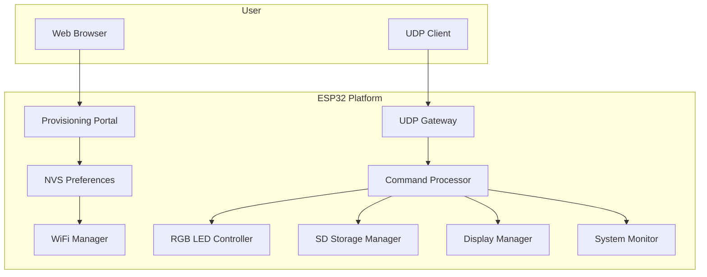
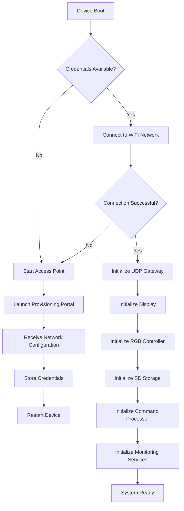

# ESP32 Network Provisioning and Remote Device Management Platform

<p align="center">
  
  
  
</p>

A robust and modular platform for securing, configuring, monitoring, and managing ESP32 devices over Wi-Fi and UDP. Built for real-world embedded applications, this project combines seamless network onboarding, remote command execution, system diagnostics, and a clean hardware abstraction layer.

## Why this project

This platform was designed to simplify the operational lifecycle of ESP32-based devices while keeping the architecture extensible and production-friendly.

It enables:

- Secure Wi-Fi provisioning without firmware re-flashing
- Persistent storage of credentials using NVS/Preferences
- Automatic reconnection and resilient networking
- Remote command execution through a UDP gateway
- Structured device diagnostics and health reporting
- Visual status feedback through RGB LEDs and display integration
- Modular design for easier maintenance and future expansion

---

## Key capabilities

- Web-based Wi-Fi provisioning portal
- Persistent credential storage with NVS
- Automatic Wi-Fi reconnection flow
- UDP-based gateway for remote control
- Device health diagnostics and telemetry
- CPU, memory, and flash monitoring
- Network metadata reporting (IP, gateway, RSSI, SSID)
- Device uptime and reset reason tracking
- Remote and local factory reset support
- Modular object-oriented software design

---

## Architecture overview

The system is organized into independent modules, each responsible for a specific subsystem. This separation promotes maintainability, extensibility, and portability across different embedded deployments.



---

## Startup sequence

The platform follows a provisioning-first device lifecycle. If no valid Wi-Fi credentials are stored, the device automatically enters access point mode and hosts a configuration portal.



---

## Wi-Fi provisioning workflow

The provisioning subsystem allows a device to be configured without requiring code changes or firmware reprogramming.


---

## UDP communication architecture

Once the device is connected to the network, the platform exposes a UDP-based interface for remote management, status queries, and device automation.

Default UDP port:

```text
4210
```


---

## Command reference

The platform exposes a lightweight UDP command surface for administration, diagnostics, telemetry, and hardware control.

### Available commands

| Command | Parameters | Description | Example response |
| --- | --- | --- | --- |
| `RESET_WIFI` | None | Clears stored Wi-Fi configuration and forces a new provisioning cycle. | `Wi-Fi configuration cleared` |
| `SET_FUSO:<gmt>` | GMT offset (-12 to +14) | Configures local timezone. | `Fuso alterado: GMT-3` |
| `DST_ON` | None | Enables daylight saving time. | `Horario de Verao ativado com sucesso!` |
| `DST_OFF` | None | Disables daylight saving time. | `Horario de Verao desativado com sucesso!` |
| `TIME` | None | Returns the current local time. | `Hora atual: 10:30:25 (GMT-3)` |
| `DATE` | None | Returns the current local date. | `Data atual: 2026-10-02` |
| `LED_ON` | None | Turns the onboard LED on. | `LED ligado` |
| `LED_OFF` | None | Turns the onboard LED off. | `LED desligado` |
| `LED_PISCA:<count>:<delay>` | Blink count and delay in ms | Performs a finite blink sequence. | `LED piscou 10 vezes com 250 ms` |
| `LED_BLINK:<interval>` | Blink interval in ms | Starts continuous asynchronous blinking. | `Blink iniciado (500 ms)` |
| `TEMP` | None | Returns the internal CPU temperature. | `CPU Temp: 42.5` |
| `CPU` | None | Returns processor information. | CPU model, frequency, cores, and memory |
| `RAM` | None | Returns memory statistics. | Free heap, minimum heap, and largest block |
| `FLASH` | None | Returns flash memory information. | Flash size and free storage |
| `INIT` | None | Returns the last reset reason. | `Motivo reset: 1` |
| `UPTIME` | None | Returns device uptime in milliseconds. | `Uptime: 123456 ms` |
| `MAC` | None | Returns device MAC address. | `MAC: AA:BB:CC:DD:EE:FF` |
| `NET_INFO` | None | Returns network status information. | IP, gateway, subnet, RSSI, and SSID |

### Core command categories

#### Network management

`RESET_WIFI`

```text
RESET_WIFI
```

`SET_FUSO`

```text
SET_FUSO:-3
```

Supported range:

```text
-12 to +14
```

#### Date and time

`TIME`

```text
TIME
```

`DATE`

```text
DATE
```

#### LED control

`LED_ON`

```text
LED_ON
```

`LED_OFF`

```text
LED_OFF
```

`LED_BLINK:500`

```text
LED_BLINK:500
```

`LED_PISCA:10:250`

```text
LED_PISCA:10:250
```

#### Hardware monitoring

`TEMP`

```text
TEMP
```

`CPU`

```text
CPU
```

`RAM`

```text
RAM
```

`FLASH`

```text
FLASH
```

`INIT`

```text
INIT
```

`UPTIME`

```text
UPTIME
```

#### Network information

`MAC`

```text
MAC
```

`NET_INFO`

```text
NET_INFO
```

---

## Command processing flow


---

## Repository structure

```text
src/
├── WiFiManager
├── UDPGateway
├── CommandProcessor
├── RGBLed
├── SDStorageManager
├── DisplayManager
├── SystemMonitor
└── Utilities

docs/
data/
README.md
```

---

## Core components

### WiFiManager
Responsible for the wireless lifecycle of the device, including:

- Wi-Fi provisioning
- Access point creation
- Connection establishment
- Automatic reconnection
- Persistent NVS credential storage

### UDPGateway
Provides the communication layer for remote command execution and external system integration through UDP messaging.

Responsibilities include:

- Packet reception
- Response transmission
- Client session handling
- Command routing

### CommandProcessor
Implements the command execution subsystem.

Responsibilities include:

- Command parsing
- Input validation
- Request dispatching
- Response generation

### RGBLed
Provides status signaling and visual feedback for the device.

Capabilities include:

- RGB color control
- Blink effects
- Connection status indication
- Error signaling

### SDStorageManager
Provides storage abstraction for persistent data operations.

Capabilities include:

- SD card initialization
- File reading
- File writing
- Storage lifecycle management

### DisplayManager
Responsible for presenting device status information to users.

Capabilities include:

- Device status display
- Network reporting
- Diagnostic output
- User notifications

### SystemMonitor
Tracks runtime health and operational metrics.

Monitored resources include:

- CPU usage
- Heap memory
- Flash memory
- Device temperature
- Network status
- Uptime statistics
- Reset diagnostics

---

## Target applications

This platform is well suited for:

- Industrial IoT deployments
- Smart building infrastructure
- Sensor and telemetry systems
- Edge computing applications
- Remote monitoring platforms
- Research and development environments
- Academic and laboratory projects
- Embedded systems education

---

## Design principles

This project follows a design philosophy centered on modularity, maintainability, scalability, and hardware abstraction.

Each subsystem operates independently, minimizing coupling and making the platform easier to evolve. New communication protocols, peripherals, storage backends, and monitoring capabilities can be added through clearly defined interfaces without disrupting the rest of the system.

---

## License

This project is released under the license defined by the repository owner.

---

## Summary

ESP32 Network Provisioning and Remote Device Management Platform is a complete, modular foundation for building resilient Wi-Fi enabled embedded systems. It blends provisioning, remote control, monitoring, and maintainability into a single cohesive architecture designed for both practical deployments and learning scenarios.

If you are building an ESP32 device that needs reliable onboarding, remote diagnostics, and simple management over UDP, this platform offers a strong starting point.
