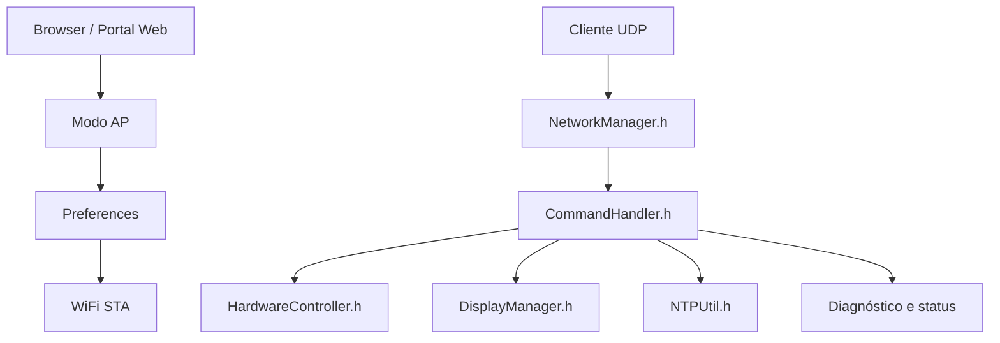
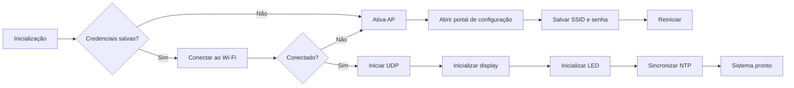

# 🌐 ESP32 Wi‑Fi Provisioning & Remote Device Management

<div align="center">


Projeto modular para provisionamento Wi‑Fi, monitoramento de sistema e controle remoto de dispositivos ESP32 em rede local.

</div>

---

## 📌 Visão geral

Este repositório implementa uma solução embarcada para dispositivos ESP32 com:

- provisionamento Wi‑Fi automatizado em modo AP/STA
- portal de configuração por navegador
- armazenamento persistente de credenciais em `Preferences`
- sincronização NTP e ajuste de timezone/DST
- controle remoto por comandos UDP na porta `4210`
- monitoramento de hardware, rede e status do sistema
- interface com display OLED e feedback visual via LED

A arquitetura foi organizada em módulos independentes para facilitar manutenção, extensão e depuração.

---

## ✨ Funcionalidades principais

- Provisionamento de rede com fallback para captive portal
- Conexão automática à Wi‑Fi salva em memória não volátil
- Reset de credenciais via comando dedicado
- Comunicação UDP com servidor de comandos textuais
- Diagnóstico local de CPU, RAM, flash, temperatura, uptime e rede
- Inicialização e controle de display OLED e LED
- Suporte a NTP para sincronização de tempo e data
- Estrutura modular por responsabilidade de arquivo

---

## 🏗️ Arquitetura do sistema



### Fluxo de boot



---

## 📁 Estrutura real do repositório

```text
esp32_wifi/
├── CHANGELOG.md
├── CommandHandler.h
├── Config.h
├── DisplayManager.h
├── HardwareController.h
├── NTPUtil.h
├── NetworkManager.h
├── README.md
├── wifi.ino
└── LICENSE (se presente no clone ou fork)
```

> A estrutura do projeto atual foi validada diretamente dos arquivos presentes no repositório. Não há pastas `src/`, `include/`, `docs/` ou `data/` no código atual.

---

## 🧩 Descrição dos arquivos principais

| Arquivo | Função |
| :--- | :--- |
| `wifi.ino` | Ponto de entrada principal do firmware e ciclo de execução do ESP32 |
| `Config.h` | Definições globais, portas, parâmetros de rede, fuso e HTML do portal |
| `NetworkManager.h` | Gerencia Wi‑Fi, AP, Preferences, UDP e respostas do protocolo |
| `CommandHandler.h` | Processa comandos recebidos e executa diagnósticos/ações do sistema |
| `DisplayManager.h` | Renderiza mensagens e relógio no display OLED |
| `HardwareController.h` | Controle do LED e estados do hardware |
| `NTPUtil.h` | Sincronização de data/hora via NTP e ajustes de timezone/DST |
| `CHANGELOG.md` | Histórico de versões e mudanças do projeto |
| `README.md` | Documentação principal do repositório |

---

## 🚀 Guia rápido de uso

### Pré-requisitos

- Placa ESP32 compatível
- Arduino IDE ou PlatformIO
- Cabo USB
- Rede Wi‑Fi local para acesso e testes

### 1) Clonar o repositório

```bash
git clone https://github.com/paulocfmarques-collab/esp32_wifi.git
cd esp32_wifi
```

### 2) Abrir no Arduino IDE

- Abra o arquivo `wifi.ino`
- Ajuste a placa e a porta serial corretas
- Compile e faça upload no ESP32

### 3) Primeiro acesso

Se o dispositivo não tiver credenciais salvas, ele entra em modo AP:

- SSID: `ESP32_CONFIG`
- Endereço do portal: `http://192.168.4.1`

No portal, informe o SSID e a senha da rede Wi‑Fi e salve.

### 4) Operação normal

Depois da conexão, o módulo:

- inicia o serviço UDP na porta `4210`
- sincroniza hora via NTP
- responde a comandos de diagnóstico e controle
- permanece pronto para integração em rede local

---

## 📡 Protocolo de comunicação

O projeto usa comunicação UDP em texto simples. A porta padrão é:

- `4210`

O cliente pode enviar comandos textuais diretamente para o IP do ESP32 na rede local e receber respostas em texto estruturado.

Exemplo de fluxo:

```text
Cliente UDP -> ESP32: help
ESP32 -> Cliente UDP: lista de comandos disponíveis
```

---

## 🧠 Comandos principais implementados

Baseado no conteúdo atual de `CommandHandler.h` e `wifi.ino`, os comandos incluem:

### Diagnóstico e status

- `help`
- `info`
- `status`
- `reason`
- `version`
- `build`
- `cpu`
- `ram`
- `flash`
- `temp`
- `mac`
- `net_info`
- `time`
- `date`
- `uptime`
- `alive`
- `psram`

### Configuração

- `reset_wifi`
- `set_fuso`
- `dst_on`
- `dst_off`

### Hardware e feedback

- `led_on`
- `led_off`
- `led_pisca`
- `led_blink`

### Exemplo de uso

```text
help
info
status
net_info
TIME
LED_ON
LED_BLINK:500
RESET_WIFI
SET_FUSO:-3
```

---

## 🔧 Monitoramento e diagnósticos

O firmware oferece informações de:

- temperatura da CPU
- memória heap e blocos livres
- uso de flash e PSRAM
- uptime do sistema
- endereço MAC
- informações de rede (IP, gateway, máscara, RSSI)
- motivo do último reset
- sincronização NTP

Esses dados são úteis para manutenção remota, depuração e revisão de operação em campo.

---

## 🛠️ Recursos de hardware

O projeto trabalha com as seguintes funções principais:

- Wi‑Fi STA/AP
- Portal web de configuração
- Display OLED
- LED de indicação
- Reset por botão
- NTP para relógio e data
- Comandos via UDP

A definição de pinagem e parâmetros do hardware ficam em `Config.h`.

---

## 🧪 Troubleshooting

### Wi‑Fi não conecta

- Verifique o SSID e a senha salvos
- Execute `reset_wifi` para limpar credenciais
- Confirme se a rede é 2.4 GHz e acessível

### UDP não responde

- Confirme que o ESP32 está conectado à rede local
- Verifique se a porta `4210` está liberada
- Teste o comando `alive`
- Confira o IP do dispositivo com `net_info`

### NTP não sincroniza

- Verifique a conexão com a internet
- Ajuste o fuso com `set_fuso:-3`
- Ative ou desative `dst_on`/`dst_off` conforme necessário

### LED não responde

- Verifique a pinagem do projeto em `Config.h`
- Teste `led_on`, `led_off` e `led_blink`
- Confirme se o sistema está com o controlador em execução

---

## 📝 Changelog

O histórico completo está disponível em [`CHANGELOG.md`](./CHANGELOG.md).

---

## 🤝 Contribuição

Contribuições são bem-vindas.

1. Faça um fork do projeto
2. Crie uma branch para sua mudança
3. Commit e push das alterações
4. Abra um Pull Request

---

## 📄 Licença

Este repositório ainda não possui uma licença declarada em arquivo explícito. Caso queira publicar uma versão pública do projeto, recomenda-se adicionar uma licença como MIT, Apache 2.0 ou GPL.

---

## 📞 Suporte

- Issues: https://github.com/paulocfmarques-collab/esp32_wifi/issues
- Pull Requests: https://github.com/paulocfmarques-collab/esp32_wifi/pulls

---

<div align="center">

Feito para a comunidade ESP32 e IoT.

</div>
