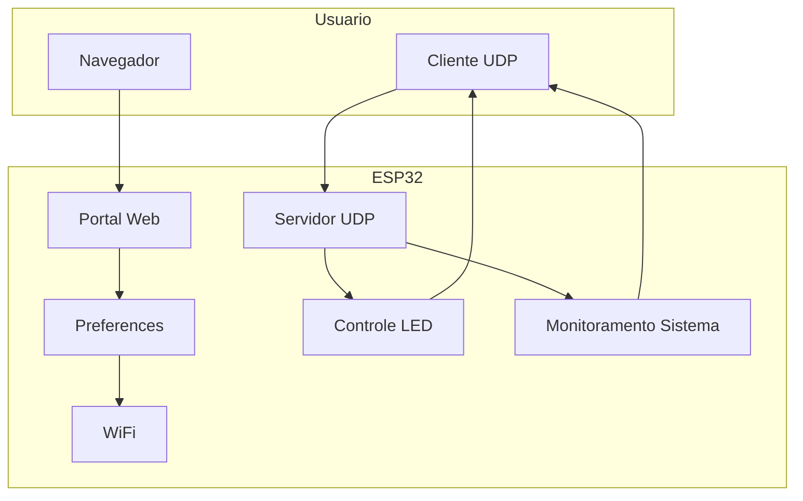
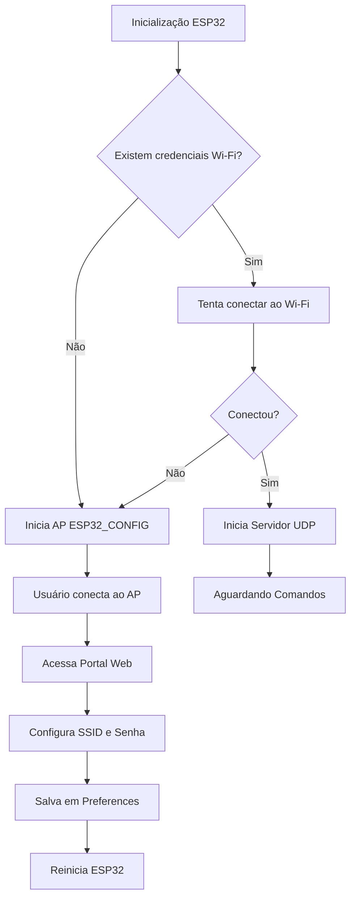
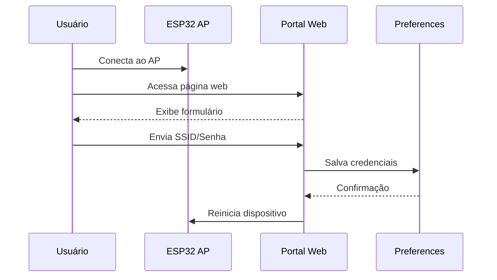
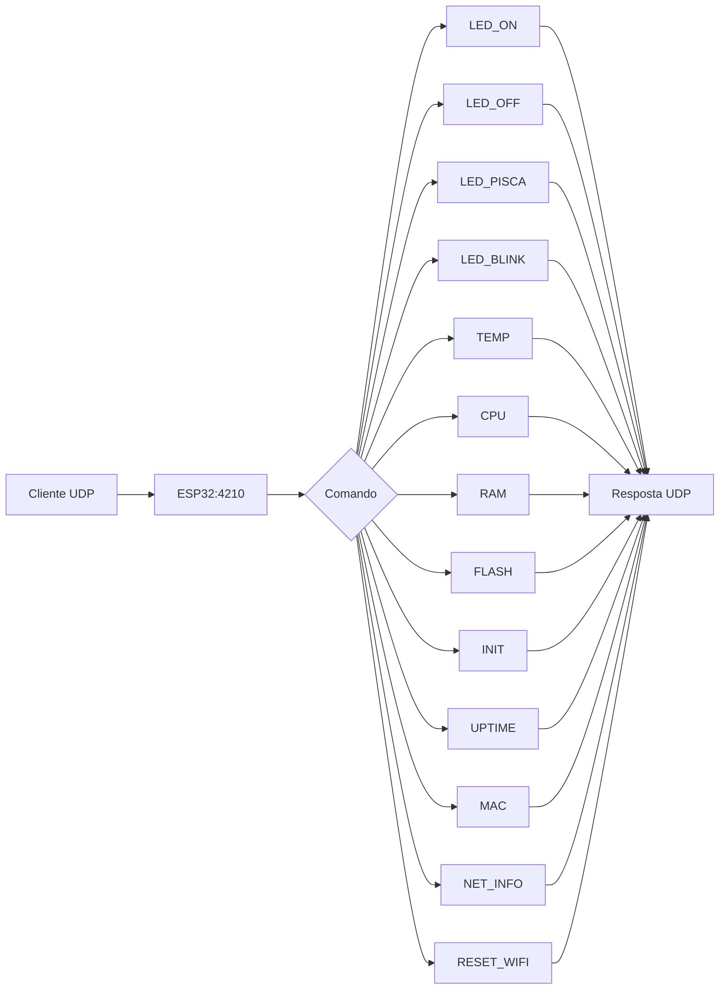
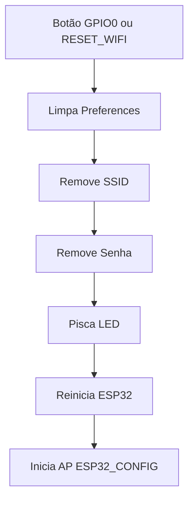
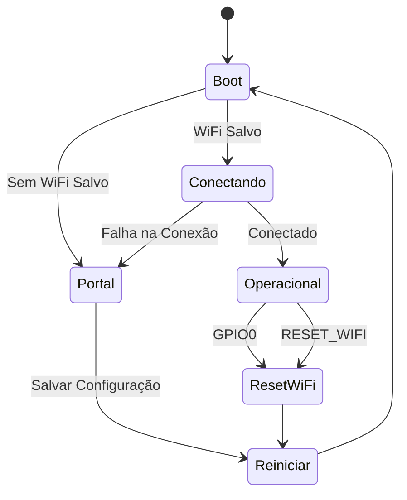

# 🚀 ESP32 Wi-Fi Provisioning & Remote Control

Sistema completo para ESP32 com configuração Wi-Fi via portal web, armazenamento persistente de credenciais, controle remoto UDP, monitoramento de hardware e gerenciamento remoto do dispositivo. Desenvolvido para facilitar a implantação de dispositivos IoT sem necessidade de recompilar o firmware para alterar configurações de rede. 【1-12ffc9】

---

## ✨ Recursos

✅ Configuração Wi-Fi através de Portal Web

✅ Armazenamento permanente de SSID e senha utilizando Preferences (NVS)

✅ Reconexão automática após reinicialização

✅ Servidor UDP para controle remoto

✅ Reset de configurações através de botão físico

✅ Reset remoto por comando UDP

✅ Controle do LED onboard

✅ Monitoramento da CPU do ESP32

✅ Informações de memória RAM

✅ Informações da memória Flash

✅ Leitura de temperatura interna

✅ Consulta do MAC Address

✅ Informações completas de rede

✅ Consulta do motivo do último reset

✅ Monitoramento de uptime do dispositivo

---

# 🏗️ Arquitetura



---

# 📦 Hardware Utilizado

| Item | Descrição |
|--------|--------|
| ESP32 | Controlador principal |
| LED GPIO 2 | Sinalização visual |
| Botão GPIO 0 | Reset das configurações |
| Wi-Fi 2.4 GHz | Comunicação de rede |

---

# 📚 Bibliotecas Utilizadas

```cpp
#include <WiFi.h>
#include <WebServer.h>
#include <Preferences.h>
#include <WiFiUdp.h>
#include "esp_system.h"
```

【1-12ffc9】

---

# 🔄 Fluxo Geral do Sistema



---

# 🌐 Processo de Configuração Wi-Fi

Quando nenhuma credencial estiver armazenada:

1. O ESP32 cria o Access Point:

```text
ESP32_CONFIG
```

2. O usuário conecta-se à rede.

3. Acessa a página de configuração.

4. Informa:

```text
SSID
Senha
```

5. As informações são armazenadas na memória NVS utilizando Preferences.

6. O dispositivo reinicia automaticamente. 【1-12ffc9】

---

## Diagrama de Provisionamento



---

# 📡 Comunicação UDP

Após conectar ao Wi-Fi, o ESP32 inicia um servidor UDP.

Porta padrão:

```text
4210
```

【1-12ffc9】

---

# 🎮 Comandos Disponíveis

## LED_ON

Liga o LED.

```text
LED_ON
```

---

## LED_OFF

Desliga o LED.

```text
LED_OFF
```

---

## LED_PISCA

Pisca o LED um número determinado de vezes.

```text
LED_PISCA:10:250
```

Onde:

```text
10 = quantidade de piscadas
250 = tempo em ms
```

---

## LED_BLINK

Pisca continuamente.

```text
LED_BLINK:500
```

Onde:

```text
500 = intervalo em ms
```

---

## TEMP

Leitura da temperatura interna.

```text
TEMP
```

---

## CPU

Retorna informações da CPU.

```text
CPU
```

Informações:

- Modelo
- Revisão
- Núcleos
- Frequência
- Heap livre

---

## RAM

Informações da memória RAM.

```text
RAM
```

Retorna:

- Heap livre
- Menor heap disponível
- Maior bloco alocável

---

## FLASH

Informações da memória Flash.

```text
FLASH
```

Retorna:

- Tamanho total
- Velocidade da Flash
- Tamanho do firmware
- Espaço livre

---

## INIT

Motivo do último reset.

```text
INIT
```

---

## UPTIME

Tempo de funcionamento.

```text
UPTIME
```

---

## MAC

MAC Address da interface Wi-Fi.

```text
MAC
```

---

## NET_INFO

Informações completas da rede.

```text
NET_INFO
```

Retorna:

- IP
- Gateway
- Máscara
- RSSI
- SSID

---

## RESET_WIFI

Remove todas as configurações Wi-Fi.

```text
RESET_WIFI
```

【1-12ffc9】

---

# 📊 Fluxo dos Comandos UDP



---

# 🔄 Reset das Configurações

O firmware permite apagar as credenciais armazenadas de duas formas.

## Método 1 - Botão Físico

Pressione o botão conectado ao:

```text
GPIO 0
```

## Método 2 - Comando UDP

```text
RESET_WIFI
```

Após executar:

1. Limpa a memória Preferences.
2. Remove SSID e senha.
3. Pisca o LED como confirmação.
4. Reinicia o dispositivo.
5. Retorna ao modo Portal de Configuração. 【1-12ffc9】

---

## Diagrama de Reset



---

# 🧠 Máquina de Estados do Firmware




